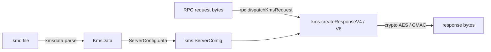

# Using vlmzsd as a library

The core protocol layer of `vlmzsd` is exposed as a Zig library module named
`vlmzsd`. It is pure logic — no `std.Io`, no libc — so it can be embedded in
any Zig project (including freestanding targets).

The `network` and `cli_helper` modules are internal to the `vlmzsd`/`vlmzs`
binaries and are **not** part of the public API.

> **Stability**: the public API is 0.x and may change between minor releases.

## Public modules

| Module | Contents |
|---|---|
| `crypto` | From-scratch AES (v4 160-bit key, v6 key-schedule XOR), CMAC, HMAC-SHA256 |
| `kmsdata` | `.kmd` binary data parsing and serialization ([`docs/kmd-format.md`](./kmd-format.md)) |
| `kms` | KMS v4/v5/v6 protocol: request/response structs, ePID generation, response build & decrypt |
| `rpc` | Hand-written DCE/RPC: BIND, NDR32/NDR64, FAULT framing |

## Adding the dependency

Add it with `zig fetch --save` — Zig resolves the URL and fills in the `url`
and `hash` for you:

```sh
zig fetch --save git+https://github.com/mogeko/vlmzsd.git#v0.3.0
```

## Wiring it into `build.zig`

```zig
const vlmzsd_dep = b.dependency("vlmzsd", .{
    .target = target,
    .optimize = optimize,
});
exe.root_module.addImport("vlmzsd", vlmzsd_dep.module("vlmzsd"));
```

## Example

```zig
const std = @import("std");
const vlmzsd = @import("vlmzsd");

pub fn main() !void {
    var dbg = std.heap.DebugAllocator(.{}).init;
    defer _ = dbg.deinit();
    const allocator = dbg.allocator();

    // Parse a .kmd data file. Copy `src/vlmcsd.kmd` from this repo, or supply
    // your own (see docs/kmd-format.md).
    const raw = @embedFile("vlmcsd.kmd");
    var data = try vlmzsd.kmsdata.parse(allocator, raw);
    defer data.deinit(allocator);

    std.debug.print("{d} CSVLC records, {d} apps\n", .{ data.csvlk.len, data.app_count });
}
```


## Getting started

Each module below gets one sentence of purpose plus its entry points. Full
signatures and semantics live in the source doc comments — read them with your
editor's autocomplete rather than expecting this page to enumerate the API.

- `crypto` — the KMS crypto primitives (AES / CMAC / HMAC-SHA256). Start from
  `aesCmacV4` (v4 CMAC) or `aesCbcEncrypt` (v5/v6 CBC).
- `kmsdata` — parse and serialize `.kmd` binary data. Start from `parse` and
  `write`.
- `kms` — the KMS v4/v5/v6 protocol itself. Start from `createResponseV6`
  (server side) or `decryptResponseV6` (client side).
- `rpc` — hand-written DCE/RPC framing. Start from `dispatchKmsRequest`
  (server side) or `wrapKmsRequest` (client side).

## How the modules fit together



`kmsdata` supplies the data, `rpc` handles DCE/RPC framing, `kms` implements
the protocol, and `crypto` is the primitive layer underneath. The dependency
chain is one-way: `rpc` → `kms` → `kmsdata` / `crypto`.

## A minimal server

The core server-side sequence, from network bytes to a KMS response.
`bind_request` and `kms_request` are raw bytes received from a socket;
`rng` and `now_unix` are supplied by the caller.

```zig
// 1. Load data and build the config — only `data` is required.
var data = try vlmzsd.kmsdata.parse(allocator, raw);
defer data.deinit(allocator);
const cfg = kms.ServerConfig{ .data = &data };

// 2. BIND negotiation records the NDR32/NDR64 context ids.
var negotiation = rpc.BindNegotiation{};
const bind_body = try rpc.buildBindResponse(allocator, bind_request, assoc_group, .{}, &negotiation);
defer allocator.free(bind_body);

// 3. Dispatch the KMS request. `response_size < 0` is an HRESULT rejection.
const result = try rpc.dispatchKmsRequest(allocator, kms_request, &negotiation, &cfg, rng, now_unix);
switch (result.kind) {
    .fault => |nca| std.debug.print("NCA fault: 0x{X:0>8}\n", .{nca}),
    .response => |body| {
        defer allocator.free(body);
        if (result.response_size < 0) {
            std.debug.print("rejected: HRESULT 0x{X:0>8}\n", .{@as(u32, @bitCast(result.response_size))});
        }
        // else: body[0..result.response_size] is the KMS response payload
    },
}
```

The client side is symmetric: `rpc.buildBindRequest` → `rpc.wrapKmsRequest`,
send, then `rpc.parseKmsResponse` → `kms.decryptResponseV6`.

## Contract and pitfalls

Rules you must know before calling into the library — they are not visible
from type signatures alone:

- **Ownership.** `kmsdata.parse` allocates every slice inside the returned
  `KmsData` with the allocator you pass in. Call `data.deinit(allocator)`
  exactly once, or you leak / double-free.
- **Wire compatibility is the invariant.** Every KMS struct is packed
  little-endian and byte-for-byte compatible with the C `vlmcsd`. Never reorder
  fields, add padding, or "improve" a field's type — clients are real Windows
  machines.
- **No global state.** Anything needing memory or randomness takes an
  allocator / RNG parameter explicitly.
- **HRESULT, not errors.** `kms.createResponseV4` / `createResponseV6` return
  an `i32` HRESULT — `kms.hresult.ok == 0` on success, a negative code (e.g.
  `0xC004F042`) on rejection. `rpc.dispatchKmsRequest` reports the same through
  `DispatchResult.response_size`. A rejected activation is a normal protocol
  answer, not a Zig error — always check the return value.
- **Freestanding-friendly.** The four public modules use neither `std.Io` nor
  libc, so they link into freestanding targets too.

Byte-level behavior is pinned by the wire-regression tests; see
[`docs/migration.md`](./migration.md) for the canonical layouts extracted from
the C reference.
